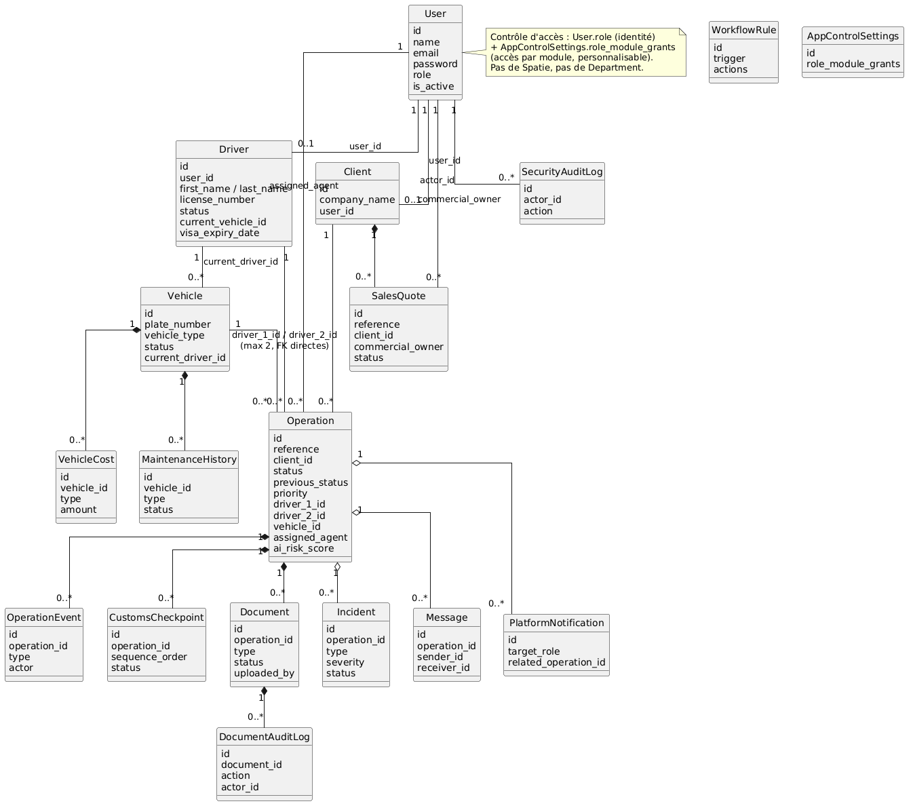
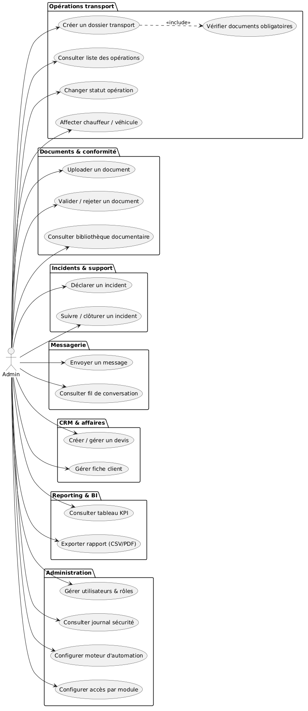
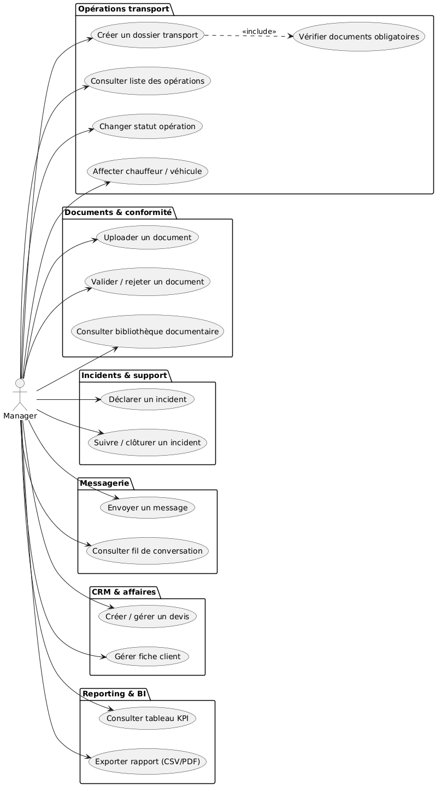
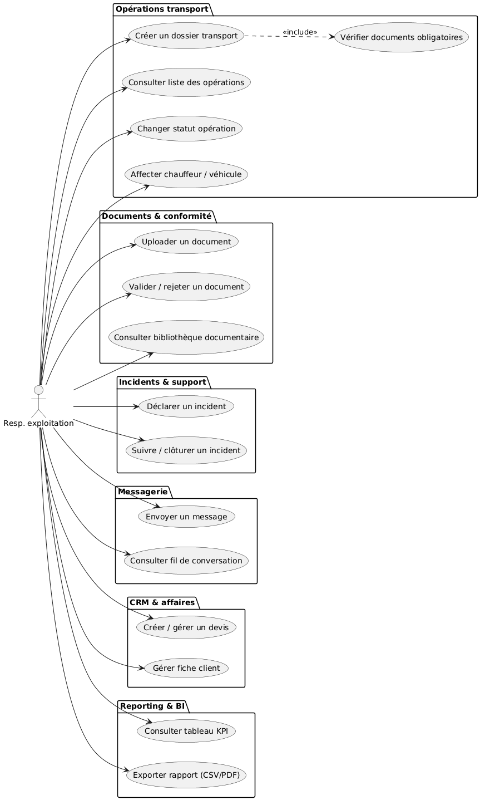
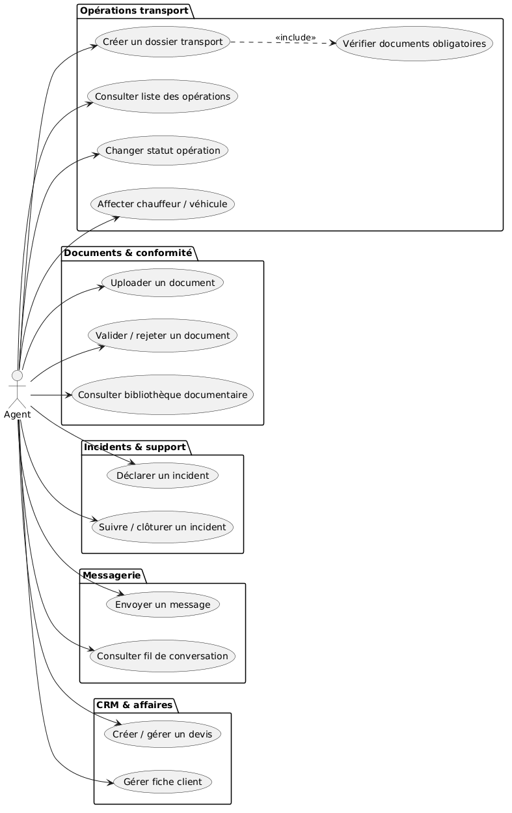
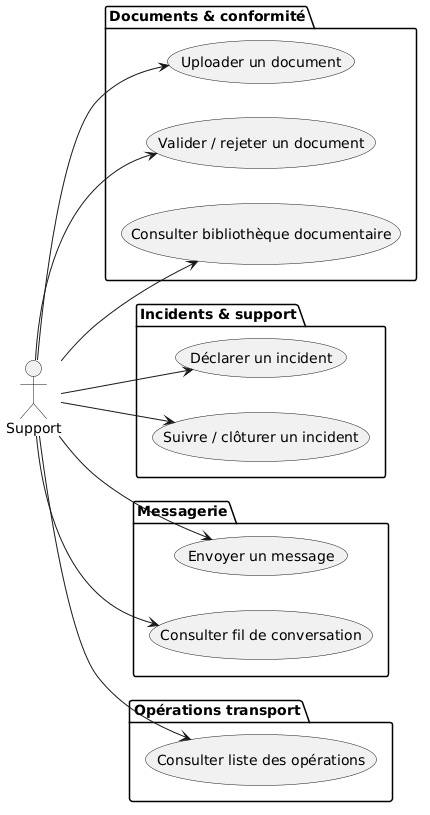
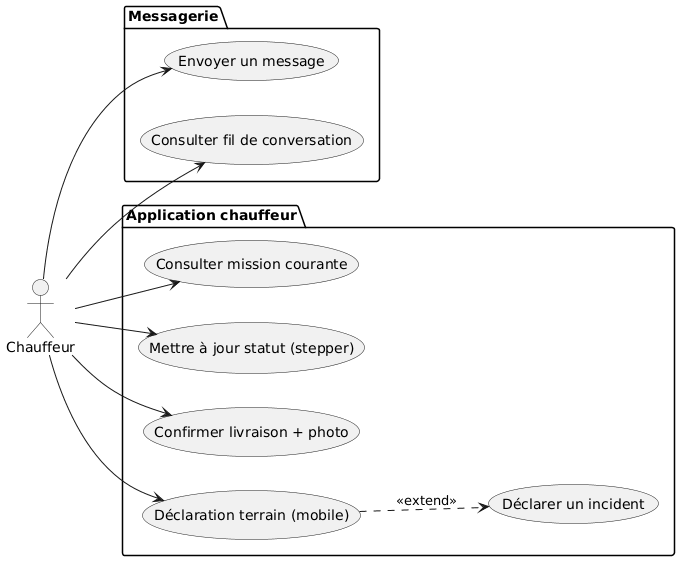
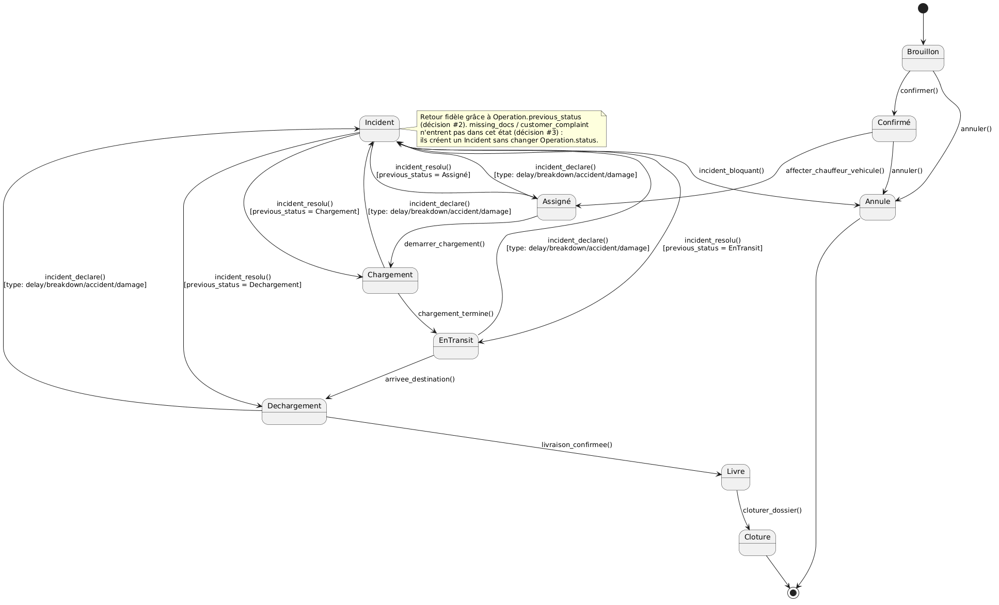

# Modélisation IksaTech LogiTrans — Version finale (post-arbitrages)
  
  
---
  
## 1. Dictionnaire de données (21 entités)
  
### 1.1 Administration
  
#### User
Table `users` — identité et droits des 7 rôles applicatifs. **Source unique de vérité pour le rôle** (pas de Spatie).
  
| Champ | Type | Contraintes | Description |
|---|---|---|---|
| id | bigIncrements | PK | Identifiant unique |
| name | string | Requis | Nom complet |
| email | string | Unique, Requis, Indexé | Identifiant de connexion |
| password | string | Requis, haché (bcrypt) | — |
| role | string/enum | Requis — admin, driver, manager, exploitation_manager, agent, support, client | Source unique de vérité du rôle |
| remember_token | string | Nullable | Session persistante Laravel |
| is_active | boolean | Défaut : true | Compte activé/désactivé |
| created_at / updated_at | timestamps | Système | Horodatage |
  
---
  
### 1.2 Flotte — Driver, Vehicle, VehicleCost, MaintenanceHistory
  
#### Driver
Table `drivers` — fiche professionnelle du chauffeur.
  
| Champ | Type | Contraintes | Description |
|---|---|---|---|
| id | bigIncrements | PK | Identifiant du chauffeur |
| user_id | foreignId | Relation 1-1, Unique, Constrained(User), CascadeOnDelete | Seule FK physique reliant Driver à User |
| first_name / last_name | string | Requis | Identité |
| phone | string | Requis, format international | Contact |
| email | string | Nullable | — |
| license_number | string | Unique, Requis | Numéro de permis pro |
| license_type | string | Requis | Catégorie (C, CE...) |
| status | string/enum | Défaut : available — available, on_mission, off_duty, on_break, inactive | Disponibilité |
| current_position | string | Nullable | Position texte libre |
| current_lat / current_lng | decimal(10,7) | Nullable | Coordonnées GPS réelles |
| current_vehicle_id | foreignId | Nullable, Constrained(Vehicle) | Véhicule actuellement utilisé |
| visa_expiry_date | date | Nullable = « sans titre enregistré » | Statut visa calculé dynamiquement — jamais stocker `visa_status` séparé |
| rating | decimal(3,2) | Nullable, /5 | Note moyenne |
| total_deliveries | integer | Défaut : 0 | Nb livraisons |
| on_time_rate | decimal(5,2) | Défaut : 100 (%) | Taux de ponctualité |
| certifications | json | Nullable — ex. ["ADR","Frigo"] | Compétences/habilitations |
| photo_url | string | Nullable | Photo de profil |
| is_active | boolean | Défaut : true | Compte actif |
  
#### Vehicle
Table `vehicles` — une seule table pour tracteurs et remorques.
  
| Champ | Type | Contraintes | Description |
|---|---|---|---|
| id | bigIncrements | PK | — |
| plate_number | string | Unique, Requis | Immatriculation |
| brand / model / year | string/string/integer | Nullable | — |
| vehicle_type | string/enum | Défaut truck_19t — van, truck_12t, truck_19t, truck_44t, semi_trailer, refrigerated, tanker | — |
| flux_category | string/enum | Nullable — national, international, mixte | CDC §6.6 |
| status | string/enum | Défaut available — available, in_use, maintenance, out_of_service | — |
| max_weight / max_volume | decimal | Nullable | Capacité max |
| temperature_controlled | boolean | Défaut false | — |
| adr_certified | boolean | Défaut false | Certifié matières dangereuses |
| current_driver_id | foreignId | Nullable, Constrained(Driver) | Point ouvert non structurel : rien n'empêche un même chauffeur d'être affecté à plusieurs véhicules — à contraindre côté validation applicative si nécessaire |
| current_lat / current_lng | decimal(10,7) | Nullable | — |
| mileage | integer | Défaut 0 | — |
| maintenance_interval_km | integer | Défaut 30000 | — |
| last_maintenance_km / date, next_maintenance_date | integer/date | Nullable | — |
| technical_inspection_date, insurance_expiry, registration_expiry | date | Nullable | Échéances réglementaires |
| fuel_consumption_avg | decimal(5,2) | Nullable | L/100km |
| total_fuel_cost / total_maintenance_cost | decimal(10,2) | Défaut 0, calculés | Cumuls depuis VehicleCost/MaintenanceHistory |
  
#### VehicleCost
Table `vehicle_costs` .
  
| Champ | Type | Contraintes | Description |
|---|---|---|---|
| id | bigIncrements | PK | — |
| vehicle_id | foreignId | Relation 1-N, Constrained(Vehicle), CascadeOnDelete | — |
| type | string/enum | Requis — fuel, maintenance, repair, insurance, tax, toll, fine, other | — |
| amount | decimal(10,2) | Requis | — |
| quantity, unit_price | decimal | Nullable | Litres ou km selon le type |
| mileage_at_transaction | integer | Nullable | — |
| supplier, invoice_number | string | Nullable | — |
| cost_date | date | Requis | — |
| notes | text | Nullable | — |
  
#### MaintenanceHistory
Table `maintenance_histories` .
  
| Champ | Type | Contraintes | Description |
|---|---|---|---|
| id | bigIncrements | PK | — |
| vehicle_id | foreignId | Relation 1-N, Constrained(Vehicle), CascadeOnDelete | — |
| type | string/enum | Défaut preventive — preventive, corrective, inspection, repair, oil_change, tire_change, brake_service, other | — |
| description | text | Requis | — |
| maintenance_date | date | Requis | — |
| mileage_at_service | integer | Nullable | — |
| cost | decimal(10,2) | Nullable/Requis selon type | — |
| service_provider | string | Nullable | — |
| next_service_km | integer | Nullable | — |
| status | string/enum | Défaut scheduled — scheduled, in_progress, completed, cancelled | — |
| notes | text | Nullable | — |
  
---
  
### 1.3 Opérations — Operation, OperationEvent, CustomsCheckpoint
  
#### Operation
Table `operations` — entité centrale, dossier de transport (national/international).
  
| Champ | Type | Contraintes | Description |
|---|---|---|---|
| id | bigIncrements | PK | — |
| reference | string | Unique, Indexé — format OP-AAAA-NNNN, auto-généré | — |
| client_id | foreignId | Relation 1-N, Constrained(Client) | — |
| type | string/enum | Requis — import, export, national, international, groupage, lot_complet | — |
| status | string/enum | Défaut draft — draft, confirmed, assigned, loading, in_transit, unloading, delivered, completed, cancelled, incident (10 statuts, CDC §5.1) | — |
| **previous_status** 🆕 | string/enum | Nullable | **Ajouté (décision #2)** — sauvegarde le statut avant passage en `incident`, pour un retour fidèle |
| priority | string/enum | Défaut medium — low, medium, high, urgent | — |
| incoterm | string | Nullable (requis si international) | Incoterms® 2020 |
| pickup_address / city / country, pickup_lat/lng | — | Requis / Nullable | Enlèvement, géocodage Nominatim |
| delivery_address / city / country, delivery_lat/lng | — | Requis / Nullable | Livraison |
| scheduled_pickup / scheduled_delivery | dateTime | Nullable | Dates planifiées |
| actual_pickup / actual_delivery | dateTime | Nullable | Dates réelles |
| eta | dateTime | Nullable | Heure d'arrivée estimée |
| driver_1_id / driver_2_id | foreignId | Nullable, Constrained(Driver) — max 2 | FK directes sur Operation, pas de table pivot |
| vehicle_id | foreignId | Nullable, Constrained(Vehicle) | — |
| cargo_description, cargo_weight/volume, cargo_pallets | — | Nullable | Marchandise |
| temperature_controlled, is_adr | boolean | Défaut false | — |
| special_instructions | text | Nullable | — |
| current_lat / current_lng | decimal(10,7) | Nullable | Position temps réel simulée |
| delay_minutes | integer | Défaut 0 | — |
| ai_risk_score | integer | Nullable, 0-100 | — |
| ai_summary | text | Nullable | — |
| assigned_agent | foreignId | Nullable, Constrained(User) | Agent exploitation responsable |
| created_at / updated_at | timestamps | Système | — |
  
  
  
#### OperationEvent
Table `operation_events` — timeline de l'opération .
  
| Champ | Type | Contraintes | Description |
|---|---|---|---|
| id | bigIncrements | PK | — |
| operation_id | foreignId | Relation 1-N, Constrained(Operation), CascadeOnDelete | — |
| type | string/enum | Requis — created, assigned, status_change, location_update, document_added, message, incident, completed, customs_passage | — |
| title | string | Requis | — |
| description | text | Nullable | — |
| actor | foreignId | Nullable, Constrained(User) | — |
| metadata | json | Nullable | — |
| created_at | timestamp | Système | — |
  
#### CustomsCheckpoint
Table (`customs_checkpoints`).
  
| Champ | Type | Contraintes | Description |
|---|---|---|---|
| id | bigIncrements | PK | — |
| operation_id | foreignId | Relation 1-N, Constrained(Operation), CascadeOnDelete | — |
| checkpoint_kind | string | Requis (ex. customs_office) | — |
| label, address, country_code | string | Requis | — |
| customs_reference | string | Nullable | — |
| lat, lng | decimal(10,7) | Nullable | — |
| sequence_order | integer | Requis | Ordre de passage |
| scheduled_window_start / end | dateTime | Nullable | Créneau prévu |
| status | string/enum | pending, ... | À affiner selon les statuts observés dans l'appli |
| radius_meters | integer | Nullable | Rayon de détection géofencing |
| arrived_at, arrived_by_name, arrived_lat/lng | — | Nullable | Preuve de passage |
  
---
  
### 1.4 Documents & conformité — Document, DocumentAuditLog
  
#### Document
Table `documents` — bibliothèque documentaire globale, flux obligatoire international à 9 pièces (Nota → Facture commerciale → CMR → Fiche chargement → MRN → T1 → Salida → EUR1 → MLV).
  
| Champ | Type | Contraintes | Description |
|---|---|---|---|
| id | bigIncrements | PK | — |
| operation_id | foreignId | Relation 1-N, Constrained(Operation), CascadeOnDelete | — |
| type | string/enum | Défaut other — nota, commercial_invoice, cmr, loading_sheet, mrn, t1, salida, eur1, mlv, bl, invoice, pod, packing_list, customs, photo, other | — |
| name | string | Requis | Nom du fichier |
| file_url / file_path | string | Requis | — |
| uploaded_by | foreignId | Constrained(User) | — |
| status | string/enum | Défaut pending — pending, validated, rejected | Rôles autorisés à valider : Admin, Manager, Agent, Support |
| validated_by / validated_at | foreignId/datetime | Nullable | — |
| rejected_by / rejected_at | foreignId/datetime | Nullable | — |
| metadata | json | Nullable | Métadonnées extraites (IA/saisie) |
| notes | text | Nullable | — |
  
#### DocumentAuditLog
Table `document_audit_logs` .
  
| Champ | Type | Contraintes | Description |
|---|---|---|---|
| id | bigIncrements | PK | — |
| document_id | foreignId | Constrained(Document), CascadeOnDelete | — |
| action | string/enum | uploaded, validated, rejected, downloaded... | À définir précisément avec l'équipe |
| actor_id | foreignId | Constrained(User) | — |
| created_at | timestamp | Système | — |
  
---
  
### 1.5 Support & Incidents — Incident
  
Table `incidents` — retards, pannes, accidents, réclamations.
  
| Champ | Type | Contraintes | Description |
|---|---|---|---|
| id | bigIncrements | PK | — |
| operation_id | foreignId | Relation 1-N, Constrained(Operation), Nullable | Résolu depuis la référence saisie |
| type | string/enum | Défaut other — delay, damage, accident, breakdown, missing_docs, customer_complaint, other | — |
| severity | string/enum | Défaut medium — low, medium, high, critical | — |
| title | string | Requis | — |
| description | text | Nullable/Requis | — |
| status | string/enum | Défaut open — open, in_progress, resolved, closed | — |
| assigned_to | foreignId | Nullable, Constrained(User) | — |
| resolution | text | Nullable, rempli au statut resolved/closed | — |
| resolved_at | datetime | Nullable | — |
| reported_by | foreignId | Constrained(User) | — |
  
> Décision #3 appliquée : seuls `delay`, `breakdown`, `accident`, `damage` déclenchés depuis un état actif de l'`Operation` font passer celle-ci en `status = incident`. `missing_docs` et `customer_complaint` restent sans impact sur le statut.
  
---
  
### 1.6 Messagerie — Message, PlatformNotification
  
#### Message
Table `messages` — échanges liés à un dossier.
  
| Champ | Type | Contraintes | Description |
|---|---|---|---|
| id | bigIncrements | PK | — |
| operation_id | foreignId | Relation 1-N, Constrained(Operation), Nullable | — |
| sender_id | foreignId | Constrained(User), CascadeOnDelete | — |
| sender_role_label | string | Nullable | Contexte affiché sous le nom |
| receiver_id | foreignId | Nullable, Constrained(User) | Destinataire direct (hors dossier) |
| content | text | Requis | — |
| type | string/enum | Défaut message — message, status_update, alert, system | — |
| attachments | json | Nullable | — |
| is_read | boolean | Défaut false | — |
| sent_at | dateTime | Requis | — |
  
#### PlatformNotification
Table `platform_notifications` .
  
| Champ | Type | Contraintes | Description |
|---|---|---|---|
| id | bigIncrements | PK | — |
| target_role | string | Requis | Rôle destinataire |
| title, body | string/text | Requis | — |
| related_operation_id | foreignId | Nullable, Constrained(Operation) | — |
| is_read | boolean | Défaut false | — |
| created_at | timestamp | Système | — |
  
> `TransitNotification` (entité vide et jamais alimentée dans le code) est ignorée.
  
---
  
### 1.7 CRM & Facturation — Client, SalesQuote
  
#### Client
Table `clients` — annuaire des donneurs d'ordre.
  
| Champ | Type | Contraintes | Description |
|---|---|---|---|
| id | bigIncrements | PK | — |
| company_name | string | Unique, Requis | Raison sociale |
| external_code, legal_id | string | Nullable | Code ERP, SIRET/TVA |
| sector | string | Nullable | — |
| contact_name, contact_email | string | Requis | — |
| phone_number | string | Nullable | — |
| address_line1, city, postal_code, country | string | address requis | — |
| payment_terms | string | Nullable | — |
| type | string | Nullable | Catégorie |
| user_id | foreignId | Relation 1-1, Nullable, Constrained(User) | Compte portail client |
| notes | text | Nullable | — |
| *rating, nb_import/export, ca, croissance_pct, satisfaction, potentiel, priorite* | — | **Champs calculés / vue CRM, non stockés** | Agrégats depuis Operation + SalesQuote |
  
#### SalesQuote
Table `sales_quotes` — devis commerciaux (brouillon → envoyé → accepté/refusé/expiré → facturé).
  
| Champ | Type | Contraintes | Description |
|---|---|---|---|
| id | bigIncrements | PK | — |
| reference | string | Unique, Indexé — format DEV-AAAA-NNNN | — |
| client_id | foreignId | Relation 1-N, Constrained(Client), CascadeOnDelete | — |
| commercial_owner | foreignId | Constrained(User) | — |
| contact_name, contact_email | string | Nullable | — |
| title | string | Requis | — |
| subtotal (amount_ht) | decimal(10,2) | Requis | — |
| vat_rate | decimal(4,2) | Requis, défaut 20.00 | — |
| discount_amount | decimal(10,2) | Défaut 0.00 | — |
| total (amount_ttc) | decimal(10,2) | Calculé | — |
| currency | string | Défaut EUR — EUR, MAD | — |
| quote_lines | json | Nullable | Lignes de détail |
| valid_until | dateTime | Requis | — |
| status | string/enum | Défaut draft — draft, sent, accepted, rejected, expired, invoiced | — |
| notes | text | Nullable | — |
  
---
  
### 1.8 Automation & Administration système
  
  
#### WorkflowRule
Table `workflow_rules` 
  
| Champ | Type | Contraintes | Description |
|---|---|---|---|
| id | bigIncrements | PK | — |
| enabled | boolean | Défaut true | — |
| trigger | string/enum | operation.created, document.validated, delay.detected, vehicle.inactive | — |
| name | string | Requis | — |
| actions | json | Requis | Ex. `{type: "platform_notify", target_roles: [...], title, body_template}` |
| created_at | timestamp | Système | — |
  
#### SecurityAuditLog
Table `security_audit_logs` 
  
| Champ | Type | Contraintes | Description |
|---|---|---|---|
| id | bigIncrements | PK | — |
| actor_id | foreignId | Constrained(User) | — |
| action | string | Requis | Ex. login, role_change, user_created |
| target_type, target_id | string/integer | Nullable | Sur quoi porte l'action |
| metadata | json | Nullable | — |
| created_at | timestamp | Système | — |
  
#### AppControlSettings
Table `app_control_settings`.
| Champ | Type | Contraintes | Description |
|---|---|---|---|
| id | bigIncrements | PK | — |
| role_module_grants | json | Nullable — null = valeurs par défaut du code, sinon `{role: [module_ids]}` | Seule source de vérité pour l'accès par module, personnalisable par l'admin (CDC §2.2 point 2 et §13.4) |
| updated_at | timestamp | Système | — |
  
---
  
## 2. Récapitulatif des relations (final)
  
| Relation | Cardinalité | Type UML |
|---|---|---|
| User → Driver | 1—0..1 | Association simple (`Driver.user_id`) |
| User → Client | 1—0..1 | Association simple (`Client.user_id`) |
| Driver → Vehicle | 1—0..* | Association simple (`Vehicle.current_driver_id`) |
| Vehicle → VehicleCost | 1—0..* | Composition |
| Vehicle → MaintenanceHistory | 1—0..* | Composition |
| Client → Operation | 1—0..* | Association simple |
| Driver → Operation | 1—0..* (×2 max) | Association simple directe (`driver_1_id`/`driver_2_id`) — pas de table pivot |
| Vehicle → Operation | 1—0..* | Association simple |
| User → Operation | 1—0..* | Association simple (assigned_agent) |
| Operation → OperationEvent | 1—0..* | Composition (CascadeOnDelete) |
| Operation → Document | 1—0..* | Composition (CascadeOnDelete) |
| Operation → CustomsCheckpoint | 1—0..* | Composition (CascadeOnDelete) |
| Operation → Incident | 1—0..* | Agrégation (FK nullable) |
| Operation → Message | 1—0..* | Agrégation (FK nullable) |
| Document → DocumentAuditLog | 1—0..* | Composition (CascadeOnDelete) |
| Client → SalesQuote | 1—0..* | Composition (CascadeOnDelete) |
| Operation → PlatformNotification | 1—0..* | Agrégation (FK nullable) |
| User → SalesQuote | 1—0..* | Association simple (commercial_owner) |
| User → SecurityAuditLog | 1—0..* | Association simple (actor_id) |
  
  
## 3. Diagramme de classes:

## 4. Matrice modules × rôles (source de vérité)
  
| Module | Admin | Manager | Resp.expl | Agent | Support | Client | Chauffeur |
|---|---|---|---|---|---|---|---|
| Dashboard | ✅ | ✅ | ✅ | ✅ | ✅ | ✅ | ✅ |
| Opérations transport | ✅ | ✅ | ✅ | ✅ | ✅ | ✅ | ❌ |
| Suivi temps réel | ✅ | ✅ | ✅ | ✅ | ✅ | ❌ | ❌ |
| Tour de contrôle flotte | ✅ | ✅ | ✅ | ✅ | ✅ | ❌ | ❌ |
| Chauffeurs & visas | ✅ | ✅ | ✅ | ✅ | ❌ | ❌ | ❌ |
| Parc & véhicules | ✅ | ✅ | ✅ | ✅ | ✅ | ❌ | ❌ |
| Documents & conformité | ✅ | ✅ | ✅ | ✅ | ✅ | ✅ | ❌ |
| Support & incidents | ✅ | ✅ | ✅ | ✅ | ✅ | ❌ | ❌ |
| Messagerie | ✅ | ✅ | ✅ | ✅ | ✅ | ✅ | ✅ |
| Reporting & BI | ✅ | ✅ | ✅ | ❌ | ❌ | ❌ | ❌ |
| IA & aide à la décision | ✅ | ✅ | ✅ | ✅ | ❌ | ❌ | ❌ |
| CRM & affaires | ✅ | ✅ | ✅ | ✅ | ❌ | ❌ | ❌ |
| Administration | ✅ | ❌ | ❌ | ❌ | ❌ | ❌ | ❌ |
| Application chauffeur | ❌ | ❌ | ❌ | ❌ | ❌ | ❌ | ✅ |
  
---
  
## 5. Diagrammes de cas d'utilisation — (par rôle)
  
### Admin

  
### Manager

  
  
### Responsable exploitation
  

  
### Agent

  
  
### Support
  

  
### client

  
  
### Chauffeur

  
  
## 6. Diagramme d'état final — Workflow Operation 
  

  
  
  